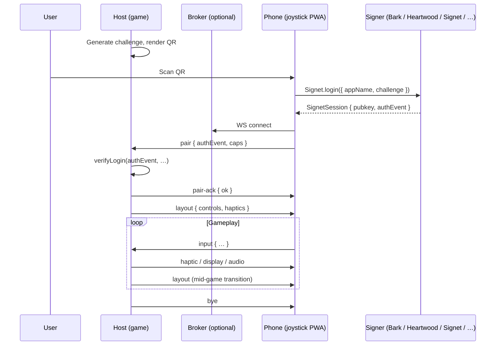

# Joystick Pairing Protocol

**Status:** draft v1.1, pre-extraction.
**Location:** interim home in `asteroid-sats/docs/` until the `forgesworn/joystick` repo exists.
**NIP candidacy:** open question, see [§ NIP candidacy](#nip-candidacy).
**Prior art reviewed:** Rocketcrab (lobby-only, no controller protocol), SmartControllerJS (academic, defers to nipplejs), nipplejs (the actual joystick ergonomics reference). See [§ Phone Implementation Requirements](#phone-implementation-requirements).

## Abstract

Joystick is a protocol for pairing a phone-as-controller to a host game via QR + WebSocket, authenticated through any Nostr signer (Bark / Heartwood / Amber / nsec.app / Signet-redirect / pasted nsec / persistent guest key). One phone PWA serves every game implementing the protocol. Game developers integrate by calling a small host SDK; user authentication is delegated to `signet-login`, so games inherit the entire Nostr signer ecosystem for free.

## Motivation

- Phones are the only universal controller. Every player has one, with biometrics, a screen, audio, a QR scanner, and a wallet.
- Nostr identity is portable across games. The same npub plays asteroid-sats, then a card game, then a treasure hunt, carrying achievements and Signet tier with them.
- Game developers already write their own Nostr login. Forcing ours is an adoption blocker. The protocol must let them either fully delegate auth to the joystick PWA or treat it as an input device only.
- Multiple games means multiple controllers, multiple layouts, mid-game layout transitions, mid-game payments, optional private displays. The protocol must handle all of these uniformly.

## Terminology

| Term | Meaning |
|------|---------|
| **Host** | The game running on a TV / desktop / laptop / projector. Renders the world. Has internet but limited input (no touch keyboard, often shared by multiple players). |
| **Phone** | The paired controller. Runs the joystick PWA. Holds the Nostr signer or proxies to one. |
| **Broker** | Optional WebSocket relay that hosts and phones connect to when they can't reach each other directly. Holds no signing keys. Stateless beyond connection routing. |
| **Joystick PWA** | The phone-side web app implementing this protocol. Canonical deployment `joystick.forgesworn.dev`; self-hosting expected. |
| **Pair token** | A signed kind-21236 `authEvent` from `signet-login`, scoped to a specific challenge issued by the host. |
| **Layout** | A JSON descriptor naming the controls the phone should render and the haptic profile to use. |

## Protocol Overview



## Pairing

### QR payload

The host renders a QR encoding a URL with the `joystick:` scheme or `https://` deep link into the PWA:

```
joystick://pair
  ?ws=wss://broker.example/relay/abc123
  &game=com.forgesworn.asteroid-sats
  &name=Asteroid+Sats
  &ch=<64-hex challenge>
  &min-tier=2                # optional, Signet tier gate
  &signet=https://mysignet.app   # optional hint; phone preference wins
  &guest=allow                   # 'allow' | 'deny', default 'allow'
  &origin=https://asteroid-sats.example  # for authEvent origin tag
```

The `ws` URL may be direct (host listens on a public WS) or via a broker (broker forwards by routing token).

### Code fallback

QR-only pairing fails when the phone camera is blocked, broken, can't focus close-up, or the user has revoked camera permission. Hosts SHOULD additionally render a short human-typeable code alongside the QR:

```
joystick://pair?code=abcd                # 4-letter [a-z], broker resolves to the same session token
```

- Brokers MUST accept `code=` and look it up against the same routing token table as a QR scan.
- Codes are 4 lowercase letters by default (456 976 namespace, large enough for thousands of concurrent sessions per broker).
- Codes expire when the underlying session token expires (host-configurable, default 10 minutes).
- The joystick PWA's home screen exposes a code-entry field as a sibling to the QR scanner button.
- Borrowed from Rocketcrab (`pages/join.tsx:23-26`).

### Phone-side flow

1. Phone PWA parses QR, validates the URL.
2. Phone calls `Signet.login({ appName: name, challenge: ch, signetAppOrigin: <user preference, fallback to QR hint, fallback to mysignet.app> })`.
3. User picks a signer; SignetSession returned. If user picks "guest", the PWA loads or creates its persistent guest nsec (see [§ Guest mode](#guest-mode)).
4. Phone opens WS to `ws`.
5. Phone sends `pair`. Host verifies, replies `pair-ack`.
6. On `ok: true`, host follows immediately with a `layout`. Gameplay begins.

### Self-hosted Signet

`signet-login` accepts a `signetAppOrigin` option. The joystick PWA exposes a user-level setting "Your Signet instance" defaulting to `mysignet.app` but freely overridable. The QR `signet=` parameter is an *advisory* hint from the host; the user's setting wins. Rationale: Signet is designed for self-hosting, no user should be forced to redirect to a third-party instance.

## Wire Messages

All messages are JSON over WS. Both directions. Discriminated by `type`. Shared envelope:

```ts
interface Envelope {
  type: string;
  seq: number;  // monotonic per direction; for dedup after reconnect
  ts: number;   // unix ms
}
```

### Pair (phone → host, once per WS lifetime)

```ts
interface Pair extends Envelope {
  type: 'pair';
  protocol: 1;
  gameId: string;                          // must match QR `game`
  identity: {
    method:
      | 'nip07'         // Bark / Alby / nos2x via window.nostr
      | 'redirect'      // Sign in with Signet (mysignet.app or self-hosted)
      | 'bunker'        // pasted bunker:// URI (Heartwood, nsecBunker, …)
      | 'nostrconnect'  // nostrconnect:// scanned by nsec.app / Amber / Keychat
      | 'amber'         // Android NIP-55
      | 'nsec'          // pasted nsec, in-memory only
      | 'guest';        // joystick-PWA-local generated key
    pubkey: string;                        // hex
    authEvent: SignetAuthEvent;            // kind 21236, signed challenge
    signetTier?: number;                   // 0..4, if known
    signetIQ?: number;                     // 0..200, if known
    expiresAt?: number;                    // hint
  };
  caps: PhoneCapabilities;
  takeover?: boolean;                      // true = drop any prior active session with this pubkey on this host; the old WS receives bye{reason:'replaced'}
  resume?: {                               // present iff reconnecting an existing session
    sessionId: string;
    lastSeq: number;
    lastLayoutId?: string;                 // last layout phone successfully rendered, lets host skip re-pushing identical layout
    resumeToken?: string;                  // opaque, issued in prior pair-ack, persisted in phone localStorage to survive host crash
  };
}
```

### Phone capabilities

```ts
interface PhoneCapabilities {
  // Input
  haptics: boolean;
  multitouch: boolean;
  pointerEvents: boolean;
  gyro: boolean;
  accel: boolean;
  ambientLight: boolean;
  camera: boolean;                         // for QR scan input, photo input
  geolocation: boolean;
  textInput: boolean;                      // virtual keyboard

  // Output
  audioOut: boolean;
  speechSynthesis: boolean;
  display: { width: number; height: number; pixelRatio: number };
  vibration: boolean;

  // Signing
  canSignEvents: boolean;                  // false only for redirect-without-session-bunker
  hasNip44: boolean;
  hasNip57: boolean;                       // can sign zap requests

  // Power / state
  wakeLock: boolean;
  batteryLevel?: number;                   // 0..1, may be omitted for privacy
  charging?: boolean;
  orientation: 'portrait' | 'landscape';

  // Payments
  lnurl: boolean;                          // phone has a LNURL-aware wallet (browser handler / Lightning extension / native intent)
  lud16?: string;                          // optional, only if user opted in to share
}
```

### Pair-ack (host → phone)

```ts
interface PairAck extends Envelope {
  type: 'pair-ack';
  ok: boolean;
  reason?:
    | 'verify-failed'      // signature / challenge / origin / freshness
    | 'wrong-game'
    | 'tier-too-low'
    | 'guest-not-allowed'
    | 'protocol-too-old'
    | 'session-not-found'  // when resume.sessionId is unknown
    | 'banned'             // host has banned this pubkey
    | 'already-paired';    // returned only when takeover was NOT set; host refuses concurrent sessions for same pubkey
  sessionId?: string;                      // assigned by host, used for resume
  resumeToken?: string;                    // opaque, phone persists in localStorage for cookie-style reconnect surviving host crash
  playerId?: string;                       // host-assigned slot identifier
}
```

### Layout (host → phone, repeatable)

```ts
interface Layout extends Envelope {
  type: 'layout';
  layoutId: string;                        // referenced by every Input event; host drops events from stale layouts
  background?: string;                     // CSS colour or url(...)
  controls: Control[];
  haptics?: HapticProfile;
  textInput?: TextInputSpec;
  orientation?: 'portrait' | 'landscape' | 'any';
  wakeLock?: boolean;                      // request the phone keep the screen on while this layout is active
  meta?: { name?: string; description?: string };
}

// pinned / required apply to every Control variant. See § Player Layout Overrides.
//   pinned   = host fixes the position; player may still recolour / resize.
//   required = this controlId MUST remain reachable in the rendered layout; player cannot hide it.
type Control =
  | { id: string; kind: 'dpad';   pos: Position; size?: number; eightWay?: boolean; diagonalThreshold?: number;  label?: string; pinned?: boolean; required?: boolean }
  | StickControl
  | { id: string; kind: 'button'; pos: Position; size?: number; label: string; hold?: boolean; colour?: string; icon?: string;   pinned?: boolean; required?: boolean }
  | { id: string; kind: 'swipe';  pos: Position; size?: { w: number; h: number };          label?: string;                       pinned?: boolean; required?: boolean }
  | { id: string; kind: 'list';   pos: Position; size:  { w: number; h: number }; items: ListItem[]; dpadNavigable?: true;       pinned?: boolean; required?: boolean }
  | { id: string; kind: 'qrscan'; pos: Position; size?: number;                            prompt?: string;                      pinned?: boolean; required?: boolean }
  | { id: string; kind: 'photo';  pos: Position; size?: number;                            prompt?: string;                      pinned?: boolean; required?: boolean };

interface StickControl {
  id: string;
  kind: 'stick';
  pos: Position;
  size?: number;                           // pad diameter in CSS px; defaults to 140 (matches asteroid-sats current MAX_RADIUS*2)
  mode?: 'static' | 'dynamic' | 'semi';    // default 'dynamic' (origin spawns where thumb lands, modern mobile-game default)
  threshold?: number;                      // 0..1 normalised magnitude below which no directional input is emitted; default 0.1
  lockX?: boolean;                         // restrict to x-axis only (side-scrollers, scroll bars)
  lockY?: boolean;                         // restrict to y-axis only
  shape?: 'circle' | 'square';             // 'square' gives full diagonal travel at corners; default 'circle'
  follow?: boolean;                        // outer base follows thumb when it exceeds max radius (no "ran out of pad"); default false for static, true for dynamic
  fadeTimeMs?: number;                     // fade-in/out duration for dynamic mode; default 120
  restOpacity?: number;                    // 0..1 opacity when stick is idle; default 0.5
  catchDistance?: number;                  // semi-mode only: re-spawn origin if next touch lands further than this from current centre; default 60
  hapticTick?: HapticPattern;              // emitted when crossing threshold from inside→outside; defaults to HapticProfile.dpadTick
  label?: string;
  pinned?: boolean;                        // host fixes the position; player may still adjust stick mode / threshold / opacity / size
  required?: boolean;                      // this controlId MUST remain reachable in the player's layout
}

interface Position {
  x: number; y: number;                    // 0..1 normalised
  anchor?: 'tl'|'tc'|'tr'|'cl'|'cc'|'cr'|'bl'|'bc'|'br';
}

interface ListItem { id: string; label: string; enabled?: boolean; sublabel?: string }

interface TextInputSpec {
  controlId: string;
  placeholder?: string;
  maxLength?: number;
  initialValue?: string;
  mode: 'osk' | 'dpad' | 'auto';           // 'auto' picks based on caps
  pattern?: 'any' | 'alphanum' | 'lud16' | 'lnurl' | 'npub' | 'numeric';
}

interface HapticProfile {
  buttonPress?:   HapticPattern;
  buttonRelease?: HapticPattern;
  dpadTick?:      HapticPattern;
  listSelect?:    HapticPattern;
}

type HapticPattern = 'light' | 'medium' | 'heavy' | number[];   // ms on/off pattern
```

### Input (phone → host, high frequency)

```ts
type Input =
  | InputDpad | InputStick | InputButton | InputSwipe | InputList
  | InputText | InputMotion | InputQrScan | InputPhoto | InputOrientation;

interface InputBase extends Envelope {
  type: 'input';
  layoutId: string;
  controlId: string;
}

interface InputDpad   extends InputBase { kind: 'dpad';   state: { u: boolean; d: boolean; l: boolean; r: boolean } }
interface InputStick  extends InputBase { kind: 'stick';  x: number; y: number }                              // -1..1
interface InputButton extends InputBase { kind: 'button'; state: 'down' | 'up' | 'hold-start' | 'hold-end'; holdMs?: number }
interface InputSwipe  extends InputBase { kind: 'swipe';  start: { x: number; y: number }; end: { x: number; y: number }; dx: number; dy: number; durationMs: number }
interface InputList   extends InputBase { kind: 'list';   state: 'select' | 'commit' | 'cancel'; index?: number; itemId?: string }
interface InputText   extends InputBase { kind: 'text';   state: 'commit' | 'cancel'; value?: string }
interface InputQrScan extends InputBase { kind: 'qrscan'; payload: string }
interface InputPhoto  extends InputBase { kind: 'photo';  dataUrl: string; mime: string; width: number; height: number }

interface InputMotion extends Envelope {
  type: 'input'; kind: 'motion';
  // Sampled at rate negotiated via motion-config, never streamed by default.
  gyro?:  { x: number; y: number; z: number };  // rad/s
  accel?: { x: number; y: number; z: number };  // m/s^2 (excluding gravity)
  abs?:   { alpha: number; beta: number; gamma: number };  // device orientation, deg
}

interface InputOrientation extends Envelope {
  type: 'input'; kind: 'orientation';
  orientation: 'portrait' | 'landscape';
}
```

### Haptic (host → phone)

```ts
interface Haptic extends Envelope {
  type: 'haptic';
  pattern: HapticPattern;
}
```

### Display (host → phone, private screen content)

For party games / hand-of-cards / private-info games. Host pushes content that only this player sees.

```ts
interface Display extends Envelope {
  type: 'display';
  surface: 'overlay' | 'fullscreen' | 'card';
  content:
    | { kind: 'text';  text: string; style?: 'plain' | 'card' | 'banner' }
    | { kind: 'html';  html: string;  csp?: 'strict' }       // sandboxed iframe, no scripts in strict mode
    | { kind: 'image'; src: string;   alt?: string }
    | { kind: 'svg';   svg: string };
  durationMs?: number;                                       // 0 / omitted = until next display
  dismissable?: boolean;
}
```

### Audio (host → phone)

```ts
interface Audio extends Envelope {
  type: 'audio';
  src: string;                                               // URL or data: URL
  volume?: number;                                           // 0..1
  loop?: boolean;
  channel?: 'sfx' | 'music' | 'voice';                       // phone groups by channel for muting
}
```

### Pay (host → phone, payment request)

Phone surfaces a Lightning invoice / LNURL-pay / LNURL-w to the user. Approval is on-phone, the user's own wallet handles the actual settlement. Host learns of completion via game-specific Nostr event or out-of-band webhook.

```ts
interface Pay extends Envelope {
  type: 'pay';
  reqId: string;
  intent: 'pay' | 'withdraw';                                // pay = phone sends sats; withdraw = phone receives sats
  amountSats: number;
  description: string;
  invoice?: string;                                          // BOLT11, present for intent='pay'
  lnurl?: string;                                            // LNURL-pay or LNURL-w
  expiresAt: number;
}

interface PayResponse extends Envelope {
  type: 'pay-response';
  reqId: string;
  state: 'opened' | 'rejected' | 'failed' | 'completed';     // 'completed' is best-effort, host should verify settlement out-of-band
  proof?: string;                                            // preimage or LNURL response, if available
  reason?: string;
}
```

### Sign-request (host ↔ phone)

```ts
interface SignRequest extends Envelope {
  type: 'sign-request';
  reqId: string;
  template: EventTemplate;                                   // kind, content, tags
  prompt?: string;                                           // "Publish your score of 12,350?"
}

interface SignResponse extends Envelope {
  type: 'sign-response';
  reqId: string;
  ok: boolean;
  event?: NostrEvent;
  reason?: 'user-rejected' | 'signer-error' | 'kind-not-allowed';
}
```

### Motion config (host → phone)

```ts
interface MotionConfig extends Envelope {
  type: 'motion-config';
  enabled: boolean;
  hz?: number;                                               // sample rate, 0..120; phone clamps to capability
  fields: Array<'gyro' | 'accel' | 'abs'>;                   // which to stream
}
```

### Notification (host → phone, attention grab)

```ts
interface Notify extends Envelope {
  type: 'notify';
  title: string;
  body?: string;
  haptic?: HapticPattern;
  sound?: string;                                            // URL
}
```

### Layout-Ack (phone → host)

After binding all controls in an incoming `layout`, the phone replies with `layout-ack`. Hosts SHOULD wait for this before relying on the phone to handle inputs against the new `layoutId`; in practice hosts may fire-and-forget for trivial transitions, but acknowledged transitions are required for hand-off-critical moments (start of round, score commit, payment screen).

```ts
interface LayoutAck extends Envelope {
  type: 'layout-ack';
  layoutId: string;
  controlsReady: string[];               // controlIds successfully bound; host can warn if missing
  controlsUnsupported?: string[];        // controls the phone could not render (unknown kind, missing capability)
  renderMs?: number;                     // time from receipt to ready, for host-side telemetry
}
```

### Kick (host → phone)

Host-initiated removal mid-session. Closes the WS after sending. Distinct from `bye` in that it is non-cooperative.

```ts
interface Kick extends Envelope {
  type: 'kick';
  reason: 'banned' | 'tier-revoked' | 'host-rule' | 'admin' | 'inactivity';
  message?: string;                      // human-readable, surfaced to user on phone
  banDurationMs?: number;                // 0 / omitted = session-only; >0 = host refuses re-pair from this pubkey for that long
}
```

### Stats (both directions, optional)

Rolling connection-health envelope, surfaced in host and phone UIs.

```ts
interface Stats extends Envelope {
  type: 'stats';
  pingMs?: number;                       // most recent round-trip
  msgsPerSec?: number;                   // 1s rolling average from sender's side
  packetLoss?: number;                   // 0..1, broker-side hint if available
}
```

### Control channel

```ts
interface Ping  extends Envelope { type: 'ping' }
interface Pong  extends Envelope { type: 'pong'; pingSeq: number }
interface Bye   extends Envelope { type: 'bye';  reason: 'host-shutdown' | 'phone-shutdown' | 'idle-timeout' | 'replaced' }
interface Err   extends Envelope { type: 'error'; code: string; message: string }
interface State extends Envelope {                          // phone tells host about local state changes
  type: 'state';
  foreground?: boolean;
  battery?: number;
  charging?: boolean;
  networkType?: 'wifi' | 'cellular' | 'unknown';
}
```

## Guest Mode

The joystick PWA generates and persists a single guest secp256k1 keypair in `localStorage` under `joystick:guest:v1`, scoped to the PWA origin. This identity is reused across all games paired with that phone, until the user clears storage or upgrades to a real Nostr signer.

```ts
// Joystick PWA's guest identity, stored in localStorage
interface StoredGuest {
  v: 1;
  nsecHex: string;             // 64-char lowercase hex
  name: string;                // chosen handle, <=64 chars
  createdAt: number;           // unix ms
}
```

Guest pairs send a `pair` with `method: 'guest'` and a real `authEvent` signed by the local key. Hosts can refuse guests via `min-tier` in the QR (any tier above 0 excludes guests) or by inspecting `identity.method` and replying with `reason: 'guest-not-allowed'`.

**Upgrade path:** the joystick PWA's settings panel offers "upgrade to real Nostr account", which runs `Signet.login({ preferredMethod: undefined })`, replaces the active session, and offers to publish a one-shot link event from the guest npub to the new npub so games can preserve history if they care.

**Security:** localStorage nsec is consumer-grade, not bank-grade. The PWA must be served same-origin only, with no third-party script tags, to limit XSS surface. Suitable for scores / achievements / receiving zaps; not suitable for holding meaningful funds.

## Login Method Ordering

The phone PWA presents `signet-login` methods in this order, most secure at top, less secure descending. Currently `signet-login` orders by ease-of-use, not security; the joystick PWA will pass a `methodOrder` option (PR pending against signet-login) to enforce the secure-down ordering shown here:

1. **Bunker URI (NIP-46)** — Heartwood / nsecBunker / Amber as a bunker. Keys never on the phone.
2. **nostrconnect:// scan** — nsec.app / Amber / Keychat. Phone shows QR; signer scans it. Keys on a different device.
3. **Bark / NIP-07** — if a browser extension is detected. Keys in extension sandbox.
4. **Sign in with Signet (redirect)** — keys held by user's Signet instance.
5. **Amber direct** — Android-only NIP-55. Keys in dedicated signer app.
6. **Generate new key** — fresh nsec, with seedphrase backup prompt.
7. **Paste nsec** — explicit warning state, in-memory only, last resort.
8. **Guest** — local generated key, persistent in PWA localStorage, no recovery.

Lower entries beyond the first three sit behind a "more options" expander so new users don't meet the footgun paths first.

## Reconnect & Resume

WS connections drop. Three failure modes, three recovery paths:

### Transient WS drop, host still alive

Phone reconnects, sends `pair` with `resume { sessionId, lastSeq, lastLayoutId }`. Host replays any host→phone messages after `lastSeq`, returns `pair-ack` with the same `sessionId`. No re-auth, since `authEvent` is still within freshness window. If `lastLayoutId` matches the host's current layout, host MAY skip re-sending it.

### Host process crash, host restarted within session window

Phone persists `{sessionId, resumeToken, lastSeq, lastLayoutId, lastAuthEvent}` in localStorage under `joystick:session:<broker-host>:<gameId>`. On reconnect, phone sends `pair` with `resume { sessionId, lastSeq, lastLayoutId, resumeToken }`. The broker, if it caches party state (recommended for shared brokers), re-spawns or re-binds a host slot from the resume token and replays. Phone is not asked to re-pair from QR. Borrowed from Rocketcrab's `lastPartyState` cookie pattern (`server/rocketcrab.ts:138-178`).

### Session garbage-collected

Host returns `pair-ack` with `reason: 'session-not-found'`. Phone discards local session state and restarts pairing (user re-scans QR or types code).

Phone deduplicates incoming messages by `seq`. Host treats input gaps as lost input (no acknowledgement layer at v1 for inputs).

### Takeover

If the user pairs again from a second phone with the same pubkey (e.g. lost the first phone), the new `pair` carries `takeover: true`. Host accepts the new session, sends `bye { reason: 'replaced' }` to the old WS, and replies `pair-ack { ok: true }` to the new one. Without `takeover: true`, a second concurrent pair from the same pubkey is refused with `reason: 'already-paired'`.

## Multi-Controller Sessions

Multiple phones may pair to one host. Each gets a distinct `playerId` from the host's `pair-ack`. The host distinguishes inputs by pubkey + sessionId. The protocol places no constraint on how many phones a host accepts; that is a game decision.

Layouts may be per-player. A host pushing a `layout` to phone A does not affect phone B.

## Phone Implementation Requirements

The wire protocol is transport. These requirements describe the implementation conformance the joystick PWA MUST meet for ergonomics that survive contact with real users. Reference implementation: **nipplejs** (`https://github.com/yoannmoinet/nipplejs`) for stick behaviour; asteroid-sats' `src/touch.ts` for tap-overloaded-pad pattern.

### Pointer ownership

- Use the Pointer Events API throughout (`pointerdown` / `pointermove` / `pointerup` / `pointercancel`). Do NOT use `touch*` events.
- Each `PointerEvent.pointerId` is owned by exactly one control at a time. A control claims an id on `pointerdown` inside its hit-test region and releases it on `pointerup` / `pointercancel`. A second pointer hitting the same control is rejected at the control level so dual-stick cross-talk is structurally impossible.
- Call `setPointerCapture(pointerId)` on `pointerdown` so the control keeps tracking even if the finger slides outside its visual bounds.
- On `visibilitychange` (PWA backgrounded), synthesise `pointercancel` for every captured pointer and release. Otherwise stuck "permanently pressed" buttons after returning from a notification.

### Stick (joystick) ergonomics

- **Default mode is `dynamic`.** Stick origin spawns where the user's thumb first lands. Thumb position should never be dictated by where CSS placed the pad. Static mode is for HUD-locked elements (steering wheel, fixed dpad). Semi mode for hybrid.
- **Threshold default 0.1.** No directional events emitted until normalised magnitude exceeds threshold. Single threshold per stick, not separate heading/thrust thresholds.
- **Follow = true by default** in dynamic mode. When thumb travels beyond max radius, outer base follows so input continues. Prevents the "ran out of pad" failure that breaks gameplay.
- **Visual states:** outer ring (base) + inner cap (thumb). Distinct from a single knob translate. Inner cap eases back to centre over 120ms on release (not snap).
- **Rest opacity 0.5** (configurable per-stick). Idle pad is visible but does not dominate the screen.
- **Haptic tick on threshold crossing** inside→outside, using `HapticProfile.dpadTick` unless `stickControl.hapticTick` overrides. Phones without `navigator.vibrate` skip silently.
- **`will-change: transform` on the inner cap** so the compositor handles per-frame translate without main-thread layout cost.
- **Diagonal handling on dpad:** default 4-way. `eightWay: true` enables diagonals with `diagonalThreshold` (default 0.4 of pad radius) to suppress jittery diagonals.

### Touch target sizing

- Minimum touch target 44 CSS px (Apple HIG) / 48 CSS px (Material). Phone MUST enforce this floor on any `size` field, regardless of host's requested size. Layouts with too-small controls render larger than the host asked but report `controlsReady` honestly in `layout-ack`.
- Stick default diameter 140px (matches asteroid-sats `MAX_RADIUS=70`).

### Safe areas

- All layouts respect `env(safe-area-inset-top|right|bottom|left)`. Positions normalised to viewport are interpreted within the safe-area rectangle, not the raw viewport. iPhone home-indicator and notch areas are never occupied by controls.
- Layout body MUST set `touch-action: none` and `overscroll-behavior: contain` on its root, and `viewport-fit: cover` in the meta viewport, to defend against iOS Safari edge-swipe back-navigation and pinch-zoom while gameplay is active.
- Phone MUST `preventDefault()` on `gesturestart`, `gesturechange`, `gestureend` while a layout is active.

### Wake lock

- When `layout.wakeLock === true`, phone requests `navigator.wakeLock.request('screen')` on layout-ack. Released on `bye` / next layout with `wakeLock !== true` / page hidden.

### Haptic / audio activation

- Both `navigator.vibrate` and `AudioContext` are gated behind a user gesture on most browsers. Phone MUST fire a one-shot zero-duration `vibrate(0)` and `audioContext.resume()` inside the first `pointerdown` after pair-ack, so subsequent host-pushed haptics and audio cues land without a re-tap.

### Stats / telemetry

- Phone MAY emit `stats` envelope every 5s when host has signalled `caps.statsRequested` (carried as an optional `caps.requestStats` boolean on host-side, defaulting off to save bandwidth).
- Phone SHOULD track local "stick ran out of pad" events (touch distance > MAX_RADIUS held for >200ms) for size-tuning telemetry; emit in `stats.notes` if instrumented.

### Player Layout Overrides

Players are not obliged to accept host-suggested layouts as-is. The joystick PWA SHOULD let each player customise position, size, colour, opacity, and stick mode per control, per game. Overrides are local to the phone and invisible to the host: input events still carry the host's original `controlId`, so a player can move the "fire" button anywhere and the host receives `fire` regardless.

**Overrideable fields by control kind:**

| Field | dpad | stick | button | swipe | list | qrscan | photo |
|-------|:----:|:-----:|:------:|:-----:|:----:|:------:|:-----:|
| `pos` (move)            | yes¹ | yes¹ | yes¹  | yes¹ | yes¹ | yes¹ | yes¹ |
| `size` (resize)         | yes  | yes  | yes   | yes  | yes  | yes  | yes  |
| `colour` / `opacity`    | yes  | yes  | yes   | yes  | yes  | yes  | yes  |
| `icon` / `label`        | -    | -    | yes   | -    | -    | -    | -    |
| `mode` (stick variant)  | -    | yes  | -     | -    | -    | -    | -    |
| `threshold`             | -    | yes  | -     | -    | -    | -    | -    |
| `lockX` / `lockY`       | -    | yes  | -     | -    | -    | -    | -    |
| `shape`                 | -    | yes  | -     | -    | -    | -    | -    |
| `follow`                | -    | yes  | -     | -    | -    | -    | -    |
| `restOpacity`           | -    | yes  | -     | -    | -    | -    | -    |
| `hapticTick`            | -    | yes  | -     | -    | -    | -    | -    |
| `eightWay`              | yes  | -    | -     | -    | -    | -    | -    |
| `hold` semantics        | -    | -    | yes   | -    | -    | -    | -    |
| `id` / `kind`           | NO   | NO   | NO    | NO   | NO   | NO   | NO   |

¹ Only if `pinned !== true`.

**Storage model:**

Phone persists overrides in `localStorage` under `joystick:overrides:<gameId>:<pubkey>` as an array of partial control records keyed by `id`:

```ts
interface ControlOverride {
  id: string;                              // matches host's Control.id; unknown ids ignored
  pos?: Position;
  size?: number | { w: number; h: number };
  colour?: string;                         // CSS colour, free-form (high-contrast / colour-blind palettes welcome)
  opacity?: number;                        // 0..1
  icon?: string;
  label?: string;
  hidden?: boolean;                        // suppress rendering entirely; rejected by phone if Control.required === true
  // stick-specific (silently ignored on non-stick controls)
  mode?: 'static' | 'dynamic' | 'semi';
  threshold?: number;
  lockX?: boolean; lockY?: boolean;
  shape?: 'circle' | 'square';
  follow?: boolean;
  restOpacity?: number;
  hapticTick?: HapticPattern;
}

interface OverrideProfile {
  name: string;                            // 'default', 'lefty', 'one-handed', 'tournament', ...
  scope: 'game' | 'global';                // per-game overrides shadow global; global is the fallback
  matchGamePalette?: boolean;              // when true, phone snaps player's chosen colours to nearest game-supplied swatch (per § Player Layout Overrides → colour scope)
  overrides: ControlOverride[];
}
```

**Application order on incoming `layout`:**

1. Start from the host's layout descriptor.
2. For each control with a player override (matching `id`): merge the override on top, except where blocked by `pinned: true` (drops `pos`) or `required: true` (drops `hidden`).
3. If after merging any `required: true` control is no longer reachable (off-screen, hidden, or zero-sized), discard ALL overrides for that control and use host values for it. Log warning.
4. Render. Emit `layout-ack` with `appliedOverrides: string[]` listing controlIds that received overrides (optional, useful for host-side diagnostics; omit for privacy in shared brokers).

**Configurator UI requirements:**

- Long-press a control to enter edit mode. Drag to reposition. Pinch to resize. Tap a swatch to recolour.
- Slider for opacity, dropdown for stick mode (when editing a stick).
- "Match game palette" toggle: when on, the colour picker snaps to the game's supplied palette (host MAY include a `palette: string[]` field on the layout); when off, free-form CSS colour input including high-contrast and colour-blind safe options.
- Profile picker: switch between named profiles. Saving a profile writes to the storage key above.
- Preview-against-live overlay: show the host's current layout faded in the background while the player drags overrides on top, so the player sees the actual gameplay context.

**Cross-device portability (v1.2 candidate):**

Players will be able to publish overrides to their Nostr relays as a parametrized replaceable event (proposed kind 30040, `d`-tag = gameId, content NIP-44 gift-wrapped to self for privacy). Phone fetches on pair and merges with local storage (Nostr wins on conflict). Same npub on any phone gets identical layouts. This is deferred from v1.1.

### Reference behaviour table

| Concern | Default | Source |
|---------|---------|--------|
| Stick mode | dynamic (floating origin) | nipplejs `dynamic` |
| Threshold | 0.1 | nipplejs default |
| Shape | circle | nipplejs default |
| Follow | true in dynamic, false in static | nipplejs |
| fadeTimeMs | 120 | nipplejs |
| restOpacity | 0.5 | nipplejs |
| Snap-back ease | 120ms cubic-bezier | nipplejs |
| Dpad mode | 4-way | asteroid-sats current |
| Touch target floor | 44 CSS px | Apple HIG |
| Stick diameter | 140 CSS px | asteroid-sats `src/touch.ts` `MAX_RADIUS=70` |
| Pointer API | Pointer Events, not Touch | asteroid-sats `src/touch.ts:187` |

## NIP Candidacy

The protocol has two distinct halves:

**Half A — Nostr-shaped, NIP candidate:**
- A new kind for "pair token" (or reuse `signet-login`'s kind 21236, if the maintainers are willing).
- Optional: a new kind for "controller capability advertisement" (phone publishes its caps so games can discover phones without QR).
- Optional: a new kind for "joystick host advertisement" so phones can browse nearby games on a relay.
- The pairing QR scheme as a documented format.

**Half B — WS transport, NOT NIP-shaped:**
- Layout / input / haptic / display / audio / pay messages over WebSockets.
- Frame-rate sensitive, not relay-mediated. Latency budget rules out gift-wrapping every button press.

Recommendation: publish Half A as a NIP once two independent implementations exist (asteroid-sats + whatever decented ships next). Half B stays as an implementation spec in this repo, referenced from the NIP. Run any NIP draft through the `prometheus:nostr-nip-review` skill before submitting to `nostr-protocol/nips`.

## Security Considerations

- **authEvent freshness:** hosts must enforce a freshness window (`signet-login` defaults to 300s + 60s skew). Stale challenges replayable across sessions otherwise.
- **Origin tag:** hosts must validate the `authEvent`'s origin tag matches the expected game origin. Cross-game replay otherwise possible.
- **WS over TLS:** brokers must serve `wss://` only. `ws://` permitted only for `localhost` development.
- **Broker trust model:** brokers are blind forwarders. They MUST NOT inspect message bodies beyond routing tokens. Recommend gift-wrapping host↔phone payloads with a per-session symmetric key derived from the pair handshake, so brokers cannot read inputs or display content. Open task for v2.
- **Guest nsec exfiltration:** XSS in the joystick PWA exposes guest keys. Same-origin serving + CSP + no third-party scripts are mandatory.
- **Payment requests:** the user always confirms on phone. The host MUST NOT treat `pay-response.state: 'completed'` as authoritative; verify settlement out-of-band (LN node webhook, NIP-57 zap receipt, etc.).
- **Tier gating:** the `min-tier` QR parameter is advisory; the host's actual `verifyLogin` + Signet tier check is authoritative.
- **Self-hosted Signet:** the joystick PWA must NEVER silently redirect to a Signet origin the user didn't choose. Host hints from QR are advisory only.

## Open Questions

- **Encrypted broker mode:** should v1 mandate end-to-end encryption between host and phone over the broker? Adds key-derivation step in pair handshake, hides input timing/content from broker.
- **Discovery without QR:** publish a kind-XXXX "host advertisement" to user's relay so phones can join games near them in the social graph. Requires care with location privacy.
- **Replay attacks across same-origin games:** if two games are on the same origin (subpaths), the `gameId` and `appName` differ but origin matches. The `authEvent` is then reusable. Mitigation: include `gameId` in the challenge derivation.
- **Code namespace exhaustion:** 4-letter `[a-z]` = 456 976 codes. At typical session lifetime (10 min) this caps a broker at ~760 concurrent sessions before collision risk gets uncomfortable. Larger games may need 5-letter codes or a vanity-prefix scheme.

## Reference Implementation

- Host SDK: `forgesworn/joystick` (planned, currently `asteroid-sats/src/controller-host.ts`).
- Phone PWA: `forgesworn/joystick` (planned, currently `asteroid-sats/src/controller-mobile.ts`).
- Broker: `forgesworn/joystick` (currently `asteroid-sats/controller-ws/`).
- Login: `forgesworn/signet-login`.
- Hardware bunker: `forgesworn/heartwood`, `forgesworn/heartwood-esp32`.
- Identity tiers: `forgesworn/signet`, `forgesworn/signet-verify`.

## Comparison to Existing Systems

| | Jackbox | Steam Link / Anywhere | Stadia controller | Joystick |
|---|---|---|---|---|
| Phone PWA pairing | Yes | No | No | Yes |
| Open protocol | No | Proprietary | Proprietary | Yes |
| Self-host the broker | No | Local LAN only | No | Yes |
| Portable identity across games | No | Steam ID, vendor-locked | Google account | Yes (Nostr) |
| Hardware signer support | No | No | No | Yes (Heartwood, Amber, …) |
| Payment integration | No | No | No | Yes (LN) |
| Multi-game from one phone install | Yes (Jackbox apps) | Per-game install | No | Yes (one PWA) |

## Changelog

- **v1.1 draft, 2026-05-14:** prior-art review pass + player agency pass.
  - **Pairing:** added 4-letter join code as fallback to QR (Rocketcrab pattern).
  - **Pair:** added `takeover?: boolean` flag for "lost-my-phone" replacement, and `resume.lastLayoutId` / `resume.resumeToken` for host-crash-survives reconnect.
  - **Pair-ack:** added `resumeToken` issued for cookie-style persistence; added `banned` reason.
  - **New messages:** `layout-ack` (phone confirms layout bound), `kick` (host-initiated removal), `stats` (rolling connection health).
  - **Stick control schema:** added `mode` (static/dynamic/semi, default dynamic), `threshold` (replaces `deadzone`), `lockX` / `lockY`, `shape`, `follow`, `fadeTimeMs`, `restOpacity`, `catchDistance`, `hapticTick`. All borrowed from nipplejs, the actual joystick-ergonomics reference.
  - **Dpad control schema:** added `eightWay` and `diagonalThreshold`.
  - **Player agency:** added `pinned?: boolean` and `required?: boolean` to every Control variant. New "Player Layout Overrides" subsection codifying override schema, profiles, configurator UI, and v1.2 Nostr-portable plan (kind 30040).
  - **New section:** Phone Implementation Requirements — codifies pointer-id ownership, safe-area handling, edge-swipe / pinch-zoom defence, wake lock, haptic/audio unlock, touch target floor, snap-back animation, will-change hint, player overrides.
  - **Reconnect & Resume:** rewritten to cover three failure modes (transient drop, host crash, GC).
  - **Open Questions:** layout-transition-timing closed (resolved by `layout-ack`). Hardware controller closed (no protocol change needed). Added code-namespace exhaustion as a new question.
- **v1 draft, 2026-05-14:** initial spec.
